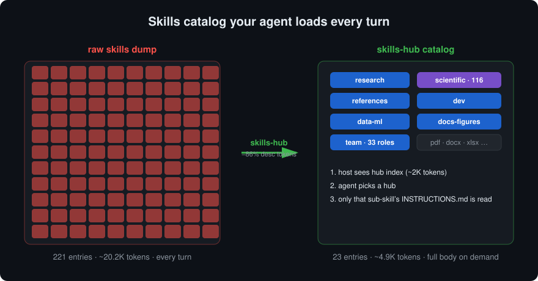
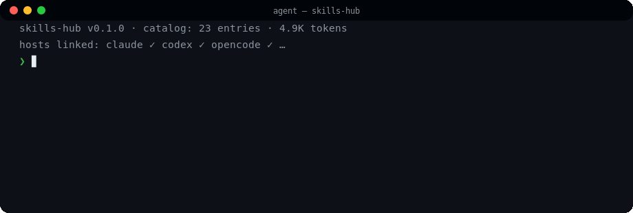

# skills-hub

**Stop loading 200 skills into your agent's context window.**

skills-hub is a curated library of **188 sub-skills and 33 expert roles** for coding agents,
organized into 7 routing hubs. Your agent sees a tiny catalog (23 entries instead of 221)
and pulls full instructions only when a task actually needs them — progressive disclosure
at the library level.

[](LICENSE)
[](https://github.com/jmche/skills-hub/actions/workflows/ci.yml)
[](VERSION)
[](#whats-inside)
[](#whats-inside)
[](#hosts)
[](https://github.com/jmche/skills-hub)

[English](README.md) · [中文](README_zh.md) · [한국어](README_ko.md)

## The problem it solves

Dropping 200 raw skills into `~/.claude/skills` burns ~20K tokens of catalog on every
turn, still leaves the agent guessing which skill to use, and hand-wiring 7 different
host directories is error-prone. skills-hub fixes this with a hub-and-spoke layout:

```text
~/.agents/skills/
├── research/      ┐
├── scientific/     │  7 hubs — SKILL.md = small index (one line per sub-skill)
├── references/     │  full instructions live in <hub>/<name>/INSTRUCTIONS.md,
├── dev/            │  read on demand, never preloaded
├── data-ml/        │
├── docs-figures/   │
└── team/          ┘  33 expert personas, invoked by name or via subagent
```

- **Catalog cost**: 82,939 → 11,898 chars of host-visible descriptions (−86%)
- **On demand**: the hub index is read first; only the chosen sub-skill body is loaded
- **Single source of truth**: every host symlinks into `~/.agents/skills` — edit once,
  all agents see it; no per-host copies to drift



## See it in action

**Routing — a protein lookup touches exactly one sub-skill:**



**grounded-build (bundled as a submodule) — evidence-backed plans on a frozen SHA:**


*(Illustrated flows. The UniProt line is real API data; grounded-build ships as its own repo — see [Related projects](#related-projects).)*

## Highlights

A few of the 188, to make it concrete:

| Skill | What it gives the agent |
|---|---|
| `scientific/alphafold2` | protein structure prediction from sequence |
| `scientific/scanpy` | full single-cell RNA-seq analysis workflows |
| `scientific/gnomad-database` | population variant-frequency lookups with proper API handling |
| `scientific/rdkit` | cheminformatics: descriptors, substructure search, reactions |
| `scientific/diffdock` | diffusion-based molecular docking |
| `scientific/opentrons-integration` | liquid-handling lab protocols |
| `references/pubmed-database` | literature search with rate-limit-aware E-utilities |
| `dev/ui-ux-pro-max` | 84 UI styles × 22 stacks for frontend work |
| `team/engineering-sre` | production incident review with an SRE's checklist |

## How this is different

| | Raw dump (200 dirs) | Awesome-list | skills-hub |
|---|---|---|---|
| Catalog cost | ~20K tokens every turn | — (links, not installed) | **~5K tokens, on demand** |
| Curation | manual | good reading list | **installed & routed** |
| Routing | agent guesses | — | **hub rules + cross-hub handoff** |
| Multi-host | hand-copy ×7 | manual | **one symlink each, idempotent** |
| Updates | re-download | manual | **one-line update** |

## Install

One command (clones to `~/.agents/skills`, asks which hosts to link, checks API keys):

```bash
curl -fsSL https://raw.githubusercontent.com/jmche/skills-hub/main/install.sh | bash
```

Interactive selection (pick hubs/skills one by one):

```bash
curl -fsSL https://raw.githubusercontent.com/jmche/skills-hub/main/install.sh | bash -s -- --select
```

Library only (for hosts like DSH that read `~/.agents/skills` directly):

```bash
curl -fsSL https://raw.githubusercontent.com/jmche/skills-hub/main/install.sh | bash -s -- --skip-hosts
```

Or via the npm ecosystem:

```bash
npx skills add jmche/skills-hub -s scientific -a claude
```

### Hosts

The installer detects installed coding agents and links the library into their skill
directories — purely additive symlinks, idempotent, never deletes your local skills:

| Host | Skills dir | Roles dir |
|---|---|---|
| Claude Code | `~/.claude/skills` | `~/.claude/agents` |
| Codex | `~/.codex/skills` | — |
| OpenCode | `~/.config/opencode/skills` | — |
| Cursor | `~/.cursor/skills` | `~/.cursor/agents` |
| Gemini CLI | `~/.gemini/skills` | `~/.gemini/agents` |
| GitHub Copilot | `~/.copilot/skills` | `~/.copilot/agents` |
| Hermes | `~/.hermes/skills` | — |

## What's inside

| Hub | Sub-skills | Covers |
|---|---|---|
| `research` | 14 | experimental design, statistics, grants, peer review, academic writing |
| `scientific` | 116 | structure prediction, genomics, 30+ databases, single-cell, cheminformatics, clinical, lab platforms |
| `references` | 20 | paper search, BibTeX, citation formats, patents, document extraction |
| `dev` | 6 | frontend, UI/UX systems, cloud, GPU, agent harness |
| `data-ml` | 21 | polars/dask, time series, stats, deep learning, graphs |
| `docs-figures` | 11 | publication figures, slides, infographics, Mermaid |
| `team` | 33 roles | SRE, PM, Architect, QA, Security, … |

Plus 16 other top-level skills: `pdf`, `docx`, `xlsx`, `pptx`, `grill-me`,
`grill-with-docs`, `find-skills`, `skill-creator`, `workflow-skill-creator`,
`credentials`, `uv`, `generate-image`, `grounded-build` (git submodule),
`omc-reference`, `autoskill`, `product-self-knowledge`.

Each hub's `SKILL.md` carries the full sub-skill index with one-line descriptions and
routing rules (when to use this hub vs. a neighboring one).

## Updating

One line, from any directory:

```bash
curl -fsSL https://raw.githubusercontent.com/jmche/skills-hub/main/install.sh | bash -s -- update
```

Or inside the repo: `bash install.sh update` (git pull + submodule sync).
Also available: `hidden` (list non-published skills) · `enable <name>` (restore one) ·
`status` (what's installed and where).

## API keys

Many skills benefit from keys (OpenAlex, NCBI, Exa, OpenRouter, …). The full list with
signup links lives in [`env.example`](env.example). Real values go in `~/.shell_env`
(or `.env` next to this README), sourced from both `~/.bashrc` and `~/.profile`:

```sh
[ -f "$HOME/.shell_env" ] && . "$HOME/.shell_env"
```

The installer offers to set this up and verifies that keys are visible under `bash -lc`.

## Design notes

- **C1 gate**: sub-skill dirs contain only `INSTRUCTIONS.md`, never a stray `SKILL.md` —
  so deep scanners (e.g. `npx skills`) cannot double-register 188 sub-skills as top-level.
- **Additive host links**: the installer never overwrites a host-local skill; it only adds
  links for skills the host is missing.
- **Private content stays private**: personal skills can sit next to the library and stay
  out of version control (our `gov-*` case) — a fresh clone never contains them.

## License

MIT for the library (routing hubs, curation, installer, tooling). Sub-skills curate
upstream content; attribution in [`LICENSE-NOTES.md`](LICENSE-NOTES.md) and the
machine-readable [`LICENSE-AUDIT.csv`](LICENSE-AUDIT.csv). Some sub-skills document
third-party tools (e.g. ProteinMPNN → MIT, OpenMS → BSD-3-Clause) — documents stay MIT;
the tools keep their own permissive licenses.

## Related projects

- [grounded-build](https://github.com/jmche/grounded-build) — repo-grounded implementation
  plans for coding agents (bundled as a git submodule)
- [agency-agents](https://github.com/msitarzewski/agency-agents) — source of the 33 role
  personas in `team/` (MIT)
